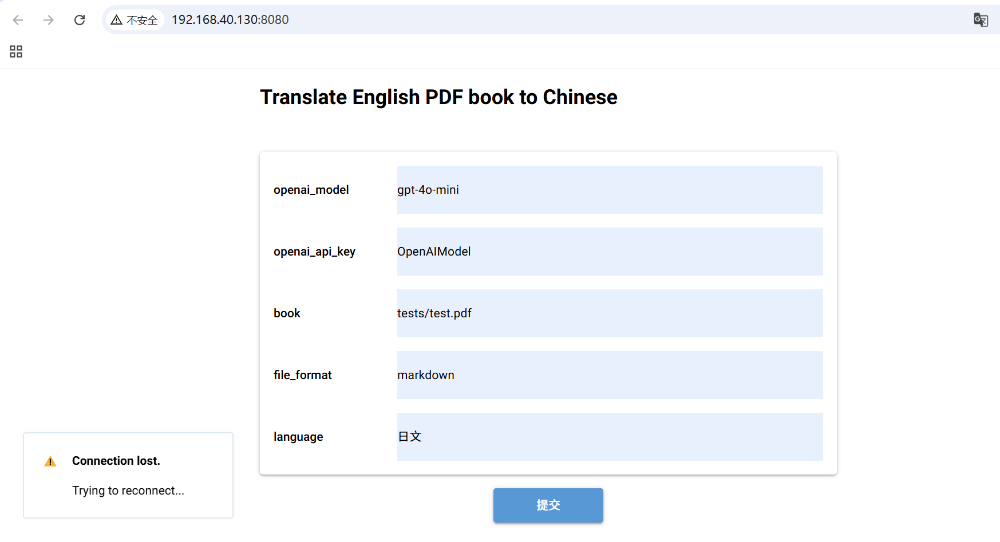

# openai-translator
openai-translator 第一次作业完成共两个功能
1. 支持图形用户界面 (GUI)， 提升易用性。
    1. 可图形化选择内容
    2. 点击提交可触发翻译作业
    3. 以下为图形化页面效果
   
2. 添加对其他语言的支持。
    可支持多语种翻译，样例中翻译为日文：
   翻译结果路径tests/test_translated.md